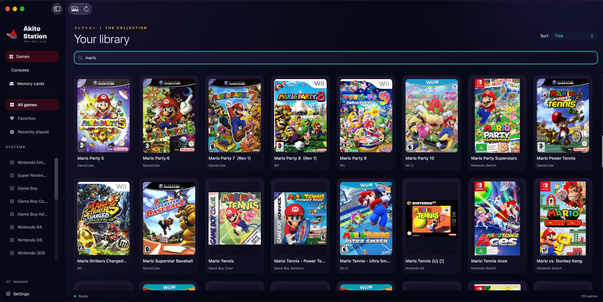

# Akito Station

Akito Station is a native macOS emulator frontend for organizing a game library and selecting compatible, separately installed runtimes. This repository contains the Public edition.



*Illustrative library screenshot supplied by the project owner. The pictured branding/theme differs from the plain system-style views in the rights-clean Public release. Game artwork belongs to its respective owners; games and artwork shown are not bundled with Akito Station.*

## Getting Started

New to Akito Station? Follow these steps in order. See the **[complete setup guide and per-system runtime table](Documentation/SETUP.md)** for details.

### 1. Download

Open [GitHub Releases](https://github.com/leoxcho/akito-station/releases), choose **Akito Station 1.0.0**, and download **Akito-Station-1.0.0-macOS-arm64.zip**. Requires **Apple Silicon / ARM64 and macOS 14.0 or later**. Games/ROMs, BIOS, firmware, console keys and emulator runtimes are **not included**. Xcode is not required just to use the downloaded app.

### 2. Install

Extract the ZIP, move **Akito Station.app** to **Applications**, then open it.

### 3. Approve first launch if required

This direct GitHub release is ad-hoc signed, not Developer ID signed or Apple-notarized. If macOS blocks it specifically because the developer cannot be verified or the app is not notarized, dismiss the warning. If you trust this official download, choose **System Settings → Privacy & Security → Open Anyway**, authenticate if requested, then confirm **Open**.

**Do not bypass malware, “will damage your computer,” or damaged-app warnings.** Stop and report those warnings. Keep Gatekeeper enabled; do not use a global disable or a Terminal security bypass. [Apple's per-app approval guidance](https://support.apple.com/en-us/102445) explains this process.

### 4. Configure storage

The first launch shows an empty library with **Open Settings**; there is no mandatory setup wizard. Open **Settings → Storage Locations**. Akito Station creates a default managed Data folder automatically, so you can leave it unchanged. **Master Akito Station data root → Choose…** selects another root; changing a path does not move existing data. Use **Move managed data with verification…** to copy existing managed data and retain the original. External-drive locations are supported; keep them connected. [Storage details](Documentation/SETUP.md#storage-and-saves).

### 5. Connect an emulator runtime

Open **Settings → Emulators**, choose your **Console**, then use **Install** where offered, or obtain a compatible runtime independently and use **Choose Existing Installation**. Select **Set Default** / **Default Emulator**. **Test Emulator** checks startup, not gameplay. Desktop runtimes normally use their own window.

**Important for 1.0.0:** source-build actions are disabled even though **Build · Requires Developer Tools** / **Install from Source** can appear. Import an independently obtained compatible ARM64 core instead. Firmware import is not firmware installation. See the [runtime table and resource instructions](Documentation/SETUP.md#emulator-runtimes) before choosing a system; a catalog entry does not promise game compatibility.

### 6. Add your games

Provide your own legally obtained game files. Go to **Settings → Storage Locations → ROM Libraries → Add folder…** and select a folder; it is scanned automatically, including supported files in subfolders. Add more folders or external-drive libraries the same way. Use **Scan libraries** or the toolbar refresh button after changing files. Regular library import is folder-based, not an individual-game picker or drag-and-drop workflow. Files remain at their original locations. Systems are inferred from extensions, supported headers and console folder names; use folders such as `ps2` or `gamecube` for ambiguous disc formats. [Import details and format limitations](Documentation/SETUP.md#add-games).

### 7. Add cover artwork

Click a game, choose **Change box art…**, then **Search online** and select a cover, or use **Choose image…** for a local image. Try a shorter title or **All systems (includes covers from other editions)** if needed. The toolbar **Scrape all box art** finds missing covers while preserving existing ones. Artwork is fetched or supplied by you, not bundled. [Artwork details](Documentation/SETUP.md#cover-artwork).

### 8. Play

In **Games / Your library**, click a game and press **Play** in its details, double-click it, or right-click → **Play**. Choose a per-game **Emulator** and **Save game profile** if you need an override. A **No emulator installed** dialog can take you to runtime setup; validation failures can instead show an error. Configure the console's default runtime, required resources and any runtime-specific setup, then retry. [Launch limitations](Documentation/SETUP.md#launch-a-game).

### 9. Saves and storage

Managed saves, save states, caches and runtime folders have separate locations in **Storage Locations**. Akito's libretro Player offers **Save State / Load State** (⌘S / ⌘L) only when the core can serialize the game; it is not a universal desktop-emulator feature. Desktop emulators can use their own save and controller settings. Keep backups before changing runtimes or paths. [Save and migration details](Documentation/SETUP.md#storage-and-saves).

### 10. Controllers

Connect or pair your controller with macOS. **Settings → Controllers** shows the detected name (or **Keyboard**). For compatible hosted cores, select a profile, adjust mappings and click **Save mappings**; changes apply to the next game. Desktop runtimes need their own controller configuration. [Controller details](Documentation/SETUP.md#controllers).

### 11. Troubleshooting

| Problem | First thing to check |
| --- | --- |
| App will not open | Apple Silicon and macOS 14+; extract the app before opening. Follow step 3 only for the specified verification warning. |
| Developer-verification warning | Trust the official download before using per-app **Open Anyway**; never bypass malware or damaged-app warnings. |
| Runtime not detected | Choose the correct console, **Choose Existing Installation** / **Relink Installation**, then set the default. |
| Game will not launch | Read the displayed error; verify the runtime, system identification, game format and required resources. **Test Emulator** does not test a game. |
| Cover not found | Shorten the search title, try **All systems**, or **Choose image…**. |
| Drive moved or disconnected | Reconnect the configured drive; reselect a moved library folder and scan. Do not reset settings as a first step. |
| Controller not detected | Connect/pair it in macOS, check the name in **Controllers**, and configure the selected desktop emulator separately. |

See [detailed troubleshooting](Documentation/SETUP.md#troubleshooting) for the relevant limits.

### 12. Safety and legal responsibility

Akito Station does not provide games, ROMs, BIOS files, firmware, console encryption keys or other copyrighted system files. You are responsible for obtaining and using software/content in accordance with applicable law and applicable licenses. Runtime installation, ABI validation and successful startup do not establish compatibility with every game. Production payment/PRO functionality has not been fully validated.

### 13. Quick-start flow

```text
Download Akito Station
↓
Install
↓
Approve first launch if required
↓
Configure storage
↓
Install/connect emulator runtime
↓
Import your games
↓
Add artwork
↓
Play
```

## Build and test

```sh
swift build --build-system native --scratch-path /tmp/akito-public-build
swift test --build-system native --scratch-path /tmp/akito-public-build
```

Package.swift is the authoritative build entry point; no Xcode project is required. Open this directory as a Swift package in Xcode. Public is the only supported edition in this export. The scripts under Scripts provide runtime management and optional app packaging. Scripts/build.sh creates a local Build app and performs local signing; the commands above compile/test source without app packaging or signing. Do not treat a local package as a signed release.

## Use

After building an app, open it, import your own supported game files, select the platform and configure an appropriate runtime. Supply required firmware or keys yourself through the relevant settings. Install or relink external runtimes using the runtime controls; select the runtime explicitly where multiple choices exist. Keep backups of saves and original content.

## Status and limitations

This repository publishes the Public source used for the 1.0.0 GitHub release. Original Akito Station code is Apache-2.0; upstream material retains its own terms and unverified artwork/patch/derived material is excluded; see Documentation/SOURCE_PUBLICATION.md and Documentation/LICENSING_INVENTORY.json. See LICENSE_SCOPE.json for exact file scope. Plain system-style views replace excluded branding and illustrations; source adapter builds are unavailable. Console support varies; passing source tests does not verify every runtime, game, controller or save workflow. No emulator runtime is approved for bundling by this export.

Payment and PRO integration code is experimental. Its complete production purchase, fulfillment, restore and account journey has not been verified. It is not advertised as production-ready.

Backend source is included directly under Backend without repository metadata. It is a reference service, deployed separately and never required for compilation. Copy Backend/.env.example into a private service environment and configure it there; every template value is empty. Never commit credentials or payment databases.

Use repository issues for support. Do not submit sensitive information publicly; private security contact is not yet configured. See SECURITY.md before reporting sensitive information.
